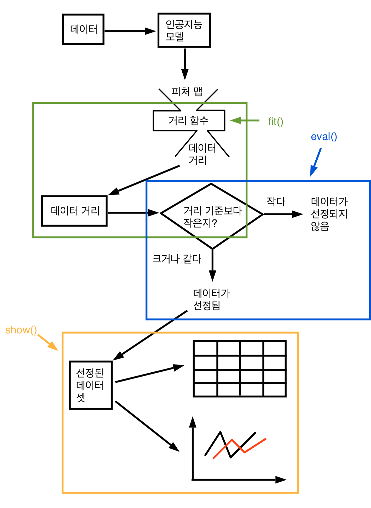
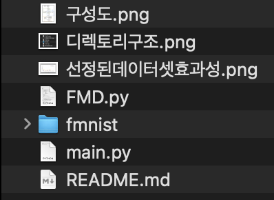
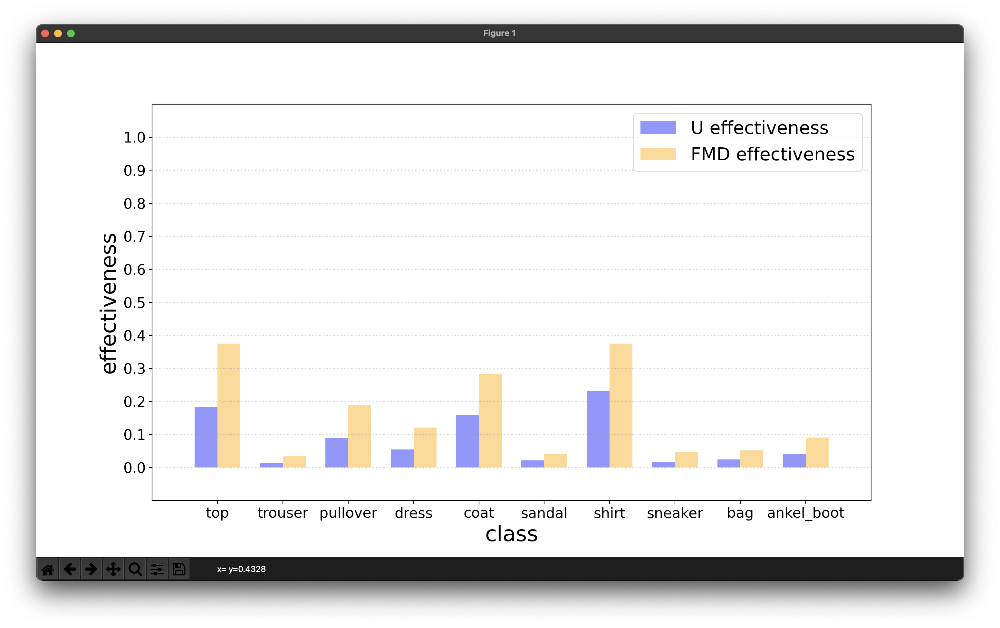

[toc]

# 목차

프로젝트 소개

팀 소개

구성도

소개 및 시연 영상

사용법

# 프로젝트 소개

## 프로젝트 명

행동 기반 DNN 테스트 데이터 선정 방법 개발

## 프로젝트 목적

DNN 모델의 취약점을 공략한 효과적인 데이터 셋을 선정한다.

## 프로젝트 개요

피처 맵을 이용하여 데이터 셋을 선정하며 이 데이터 셋의 효과성을 따져본다.

# 팀 소개

* 이상근, zlwkr1974@gmail.com, 프로젝트 코드 설계 및 구현, 시각화 자료 구성
* 정선우, dortus64@pusan.ac.kr, 데이터 수집, 데이터 변형 및 구성, 학습된 모델을 바탕으로 한 시스템 설계
* 하태훈, gkxogns21@gmail.com, 모델 작성 및 구성, 기존 모델 및 방법 분석, 진행 내용 정리

# 구성도

1. 피처 맵 출력

    * 데이터(이미지)를 인공지능 모델에 입력한다.

    * 그러면 인공지능 모델에서 피처 맵이 출력된다.

2. fit: 데이터 거리와 거리 기준 구하기

    * 거리 함수를 고른다.
    * 데이터의 피처 맵을 거리 함수로 측정하여 데이터 거리를 구한다.
    * 데이터 거리로 거리 기준을 정한다.

3. eval: 데이터 선정하기

    * 데이터를 거리 기준으로 선정한다.
    * 선정된 데이터의 표나 그래프를 그리기 위한 데이터 구한다.

4. show: 선정된 데이터 셋 효과성 보이기

    * 표를 통해 효과성을 보인다.
    * 그래프를 통해 효과성을 보인다.

# 소개 및 시연 영상

## 소개

학습된 인공지능 모델의 결함으로 인해 많은 인명 피해가 발생하였다.

따라서, 모델의 결함을 보완하기 위한 효과적으로 모델을 재학습할 수 있는 데이터 셋이 필요하다.

데이터 셋에는 모델의 결함을 보완해줄 수 있는 데이터가 상대적으로 적다. 따라서, 전체 데이터 셋을 모두 사용한다면 매우 비효율적이다.

이에 전체 데이터 셋을 모두 사용하면 비효율적이므로 효과적인 데이터의 비율이 높은 데이터 셋을 고르기 위한 프로젝트를 진행하였다.

모든 데이터마다 거리를 구하였다. 특정 거리 기준보다 데이터의 거리가 크거나 같으면 선정하였고 작으면 선정하지 않았다.

이와 같은 방법으로 데이터를 선정하여 선정된 데이터 셋의 효과성을 따져본 결과 전체 데이터 셋의 효과성보다 더 높은 효과성을 보였다.

결과적으로, 이 프로젝트는 모델의 결함을 보완하기 위한 목적으로 효과적으로 모델을 재학습할 수 있는 데이터 셋을 찾을 수 있었다.

## 프로젝트 시연 영상

[유튜브 영상](https://www.youtube.com/watch?v=P-Kd26pXsvs)

# 사용법

## 소프트웨어 요구사항

* OS
    * Mac(Intel, Apple Silicon), Windows, Linux, ...
* python 3.10.6

    * numpy 1.23.2
* matplotlib 3.5.3

> 코드를 설계한 조원은 MacBook Air 2020, MacBook Air M1 모두를 이용하여 코드를 설계했다.
>
> 해당 컴퓨터들에 설치한 OS는 macOS Monterey 12.6이다.
>
> 하지만 다른 맥, 윈도우, 리눅스에서도 파이썬과 관련 모듈만 버전에 맞게 설치하면 main.py를 실행할 수 있다.

## 설치법

파이썬과 파이썬 모듈만 설치하면 바로 main.py 파일을 실행시킬 수 있다.

OS 혹은 사용자 인터페이스에 따라 설치 방법이 다를 수 있다. 예를 들어, mac은 homebrew, ubuntu는 apt-get 으로 설치하기 때문이다. 또한, 웹에서도 프로그램을 바로 다운 받을 수도 있다.

따라서, 설치하는 도구나 방법은 컴퓨터 환경에 맞춰서 파이썬 및 파이썬 모듈을 설치하면 된다.

## 간단한 사용법

[구성도](#구성도)에서 소개한 fit, eval 과정을 수행하기에는 공간적 복잡도가 높고 수행과정도 복잡하다고 판단되어 show 과정의 일부를 출력할 수 있도록 했다.

main.py 경로에서 위 사진의 main.py를 'python main.py'와 같은 명령어로 실행시키면 아래와 같은 선정된 데이터의 효과성을 보여주는 데이터를 출력한다.

* 참고

    * U effectiveness는 전체 데이터 셋의 effectiveness이고 FMD effectiveness는 전체 데이터 셋에서 선정된 데이터 셋의 effectiveness이다.

    * U effectiveness보다 FMD effectiveness가 더 높을수록 더 효과적이다.

